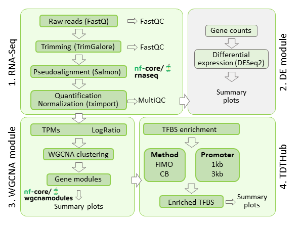

<h1>
  <picture>
    <source media="(prefers-color-scheme: dark)" srcset="docs/images/nf-core-wgcnamodules_logo_dark.png">
    
  </picture>
</h1>

<!-- [](https://github.com/nf-core/wgcnamodules/actions/workflows/ci.yml) -->
<!-- [](https://github.com/nf-core/wgcnamodules/actions/workflows/linting.yml)[](https://nf-co.re/wgcnamodules/results)[](https://doi.org/10.5281/zenodo.XXXXXXX) -->
<!-- [](https://www.nf-test.com) -->

[](https://www.nextflow.io/)
[](https://docs.conda.io/en/latest/)
<!-- [](https://www.docker.com/)
[](https://sylabs.io/docs/)
[](https://tower.nf/launch?pipeline=https://github.com/nf-core/wgcnamodules)

[](https://nfcore.slack.com/channels/wgcnamodules)[](https://twitter.com/nf_core)[](https://mstdn.science/@nf_core)[](https://www.youtube.com/c/nf-core) -->

## Introduction

**nf-core-wgcnamodules** is a bioinformatics pipeline complementary to [`nf-core/rnaseq`](https://github.com/nf-core/rnaseq) and [`TDTHub`](http://acrab.cnb.csic.es/TDTHub/) that can be used to infer relevant TF regulators in 60 different plant species from RNA-seq data. It takes a samplesheet and the salmon folder from a RNA-seq quantification analisys with  [`nf-core/rnaseq`](https://github.com/nf-core/rnaseq), performs a diferential expression analisys, WGCNA, and generates clusters of co-expressed genes to search for enriched TFBS using [`TDTHub`](http://acrab.cnb.csic.es/TDTHub/).

<picture>
  
</picture>

1. RNA-seq quantification using nf-core pipeline ([`nf-core/rnaseq`](https://github.com/nf-core/rnaseq)).
2. Differential Expression Genes filter ([`DESeq2`](https://bioconductor.org/packages/release/bioc/html/DESeq2.html)).
3. WGCNA ([`WGCNA`](https://cran.r-project.org/web/packages/WGCNA/index.html)).
4. TDTHub ([`TDTHub`](http://acrab.cnb.csic.es/TDTHub/)).
## Usage

<!-- >TODO  **NOTE**
> If you are new to Nextflow and nf-core, please refer the methods in [the book chapter](https://nf-co.re/docs/usage/installation). Otherwhise  refer to [this page](https://nf-co.re/docs/usage/installation) on how to set-up Nextflow. Make sure to [test your setup](https://nf-co.re/docs/usage/introduction#how-to-run-a-pipeline) with `-profile test` before running the workflow on actual data. -->

> **NOTE**
> Example files to get familiar with and test the pipeline are available at [wgcnamodules_testdata](https://github.com/roldanjg/wgcnamodules_testdata). We recommend to test pipeline using these files when you run it for the first time.

> **NOTE**
> Parameters configuration and extensive details are available in the [documentation](docs/README.md) and in the [the book chapter](https://nf-co.re/docs/usage/installation) associated to this pipeline 


First, run ([`nf-core/rnaseq`](https://github.com/nf-core/rnaseq)) and prepare a samplesheet with your input data that looks as follows:

`samplesheet_wgcna.csv`:

```csv
sample,condition,replicate
CONTROL1_REP1,CONTROL1,1
CONTROL1_REP2,CONTROL1,2
TREATMENT1_REP1,TREATMENT1,1
TREATMENT1_REP2,TREATMENT1,2
TREATMENT2_REP1,TREATMENT2,1
TREATMENT2_REP2,TREATMENT2,2
```

Where the columns correspond to: 
1.	‘sample’: same name as the 'samplesheet_rnaseq.csv' sample column. 
2.	‘condition’: name of the treatment, genotype or group that defines an experimental condition with one or multiple replicates. 
3.	‘replicate’: number of the biological replicate.

Prepare a metadata file with the following format:

`contrast_wgcna.csv`:

```csv
contrast,variable,control,target
TREATMENT1_vs_CONTROL1,condition,CONTROL1,TREATMENT1
TREATMENT2_vs_CONTROL1,condition,CONTROL1,TREATMENT2 
```
Where the columns correspond to: 
1.	‘contrast’: a custom name used to identify the contrast.
2.	‘variable':  the name of the column from 'samplesheet_wgcna.csv' file that contains the condition ids. 
3.	'control': the base/reference level for the contrast. 
4.	'target': the target/ non-reference level for the comparison. 


<!-- TODO nf-core: Describe the minimum required steps to execute the pipeline, e.g. how to prepare samplesheets.
     Explain what rows and columns represent. For instance (please edit as appropriate):

First, prepare a samplesheet with your input data that looks as follows:

`samplesheet.csv`:

```csv
sample,fastq_1,fastq_2
CONTROL_REP1,AEG588A1_S1_L002_R1_001.fastq.gz,AEG588A1_S1_L002_R2_001.fastq.gz
```

Each row represents a fastq file (single-end) or a pair of fastq files (paired end).

-->

Now, you can run the pipeline using:
```bash
nextflow run nf-core-wgcnamodules \
    -profile conda \
    --input samplesheet_wgcna.csv \ 
    --contrast contrasts_wgcna.csv \
    --salmon_dir <PATH_TO_NF-CORE/RNASEQ_SALMON_FOLDER>/salmon \
    --diff_exp_genes true \
    --outdir <OUTDIR>
```

For more details and further functionality, please refer to the [usage documentation](docs/usage.md) and the [book chapter](docs/output.md).

## Pipeline output

For more details about the output files and reports, please refer to the
and the [output documentation](docs/output.md).

## Credits

nf-core-wgcnamodules was originally written by roldanjg. 

## Citations

<!-- TODO nf-core: Add citation for pipeline after first release. Uncomment lines below and update Zenodo doi and badge at the top of this file. -->
<!-- If you use nf-core/wgcnamodules for your analysis, please cite it using the following doi: [10.5281/zenodo.XXXXXX](https://doi.org/10.5281/zenodo.XXXXXX) -->

<!-- TODO nf-core: Add bibliography of tools and data used in your pipeline -->

If you use nf-core/wgcnamodules for your analysis, please cite it using the following doi:

> **XXXXXXXXXXXXX**
>
> Grau J. & Franco-Zorrilla JM.
>
>XXXXX 2024 X X. doi: [XXXX](XXXXXX).


An extensive list of references for the tools used by the pipeline can be found in the [`CITATIONS.md`](CITATIONS.md) file.
You can cite the `nf-core` publication as follows:

> **The nf-core framework for community-curated bioinformatics pipelines.**
>
> Philip Ewels, Alexander Peltzer, Sven Fillinger, Harshil Patel, Johannes Alneberg, Andreas Wilm, Maxime Ulysse Garcia, Paolo Di Tommaso & Sven Nahnsen.
>
> _Nat Biotechnol._ 2020 Feb 13. doi: [10.1038/s41587-020-0439-x](https://dx.doi.org/10.1038/s41587-020-0439-x).


## Contributions and Support

If you would like to contribute to this pipeline, please see the [contributing guidelines](.github/CONTRIBUTING.md).
> _**NOTE** This pipeline was created to run complementary to [`nf-core/rnaseq`](https://github.com/nf-core/rnaseq) and is not an official release from the nf-core team, but is intended to subscribe to the standards, practices and procedures established by nf-core community._

<!-- For further information or help, don't hesitate to get in touch on the [Slack `#wgcnamodules` channel](https://nfcore.slack.com/channels/wgcnamodules) (you can join with [this invite](https://nf-co.re/join/slack)). -->