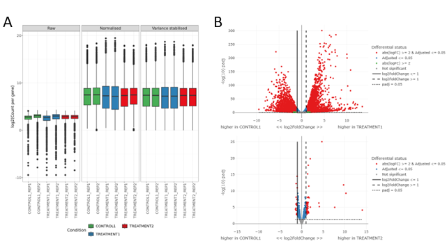
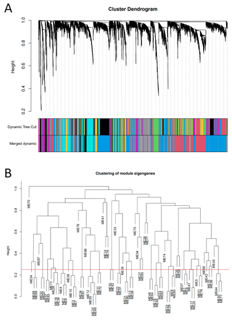
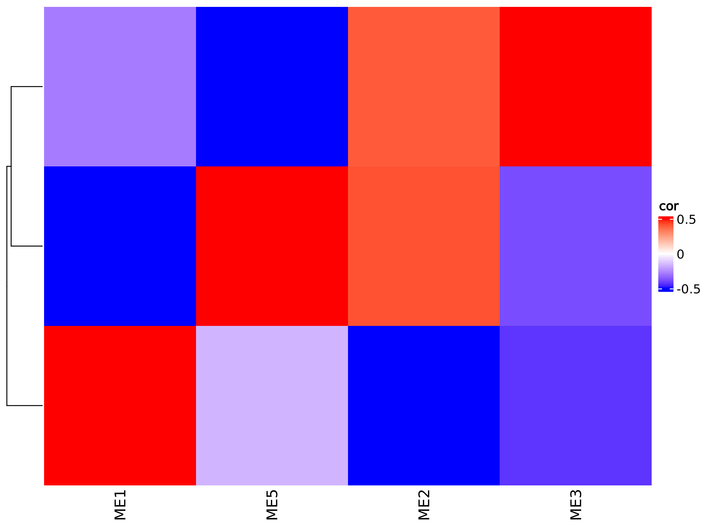

# nf-core-wgcnamodules: Output

## Introduction

nf-core-wgcnamodules is a best practice pipeline used to generate input files for [`TDTHub`](http://acrab.cnb.csic.es/TDTHub/).

This document describes the output produced by the pipeline. Plots are taken from the Markdown report and the output folder, which summarises results at the end of the pipeline.

The directories listed below will be created in the results directory after the pipeline has finished. All paths are relative to the top-level results directory.

<!-- TODO nf-core: Write this documentation describing your workflow's output -->

## Pipeline overview

The pipeline is built using [Nextflow](https://www.nextflow.io/)/nf-core and processes data using the following steps:

1. (Optional) Differential Expression Genes filter ([`DESeq2`](#DESeq2)).
2. WGCNA ([`WGCNA`](https://cran.r-project.org/web/packages/WGCNA/index.html)).

### Differential Expression Genes filter

Output files

- `diff_output_files/`
  - `all.normalised_counts.tsv`: .
  - `all.*.tsv`: .
  - `*deseq2.results.tsv`: .
  - `report/study.html`: .
- `wgcna_input_files/`
  - `diff_selected_genes.txt`(optional): .

This first step generates the gene list to perform gene clutering, it is based on the [nf-core/differentialabundance](https://nf-co.re/differentialabundance/1.5.0) pipeline.

**note**
The DE quantification plots displayed here are part of the `report/study.html`.

### WGCNA

Output files

- `wgcna_output_files/`
  - `tdthub_modules/*.csv`: .
  - `module_eigengene_values.csv`: .
  - `module_trait_relationship.png`: .
  - `modules_dendogram_before_after.pdf`: .
  - `modules_distance.pdf`: .

[WGCNA](https://cran.r-project.org/web/packages/WGCNA/index.html) is used to perform gene clustering to identify gene modules highly correlated and, therefore, expected to share some common regulatory mechanisms. Gene clustering can be performed from complete gene sets or form pre-filtered differentially expressed gene (DEG) sets.

**note**
`modules_dendogram_before_after.pdf`, `modules_distance.pdf`
##

**note**
`module_trait_relationship.png

### Pipeline information

Output files

- `pipeline_info/`
  - Reports generated by Nextflow: `execution_report.html`, `execution_timeline.html`, `execution_trace.txt` and `pipeline_dag.dot`/`pipeline_dag.svg`.
  - Reports generated by the pipeline: `pipeline_report.html`, `pipeline_report.txt` and `software_versions.yml`. The `pipeline_report*` files will only be present if the `--email` / `--email_on_fail` parameter's are used when running the pipeline.
  - Reformatted samplesheet files used as input to the pipeline: `samplesheet.valid.csv`.
  - Parameters used by the pipeline run: `params.json`.

[Nextflow](https://www.nextflow.io/docs/latest/tracing.html) provides excellent functionality for generating various reports relevant to the running and execution of the pipeline. This will allow you to troubleshoot errors with the running of the pipeline, and also provide you with other information such as launch commands, run times and resource usage.
